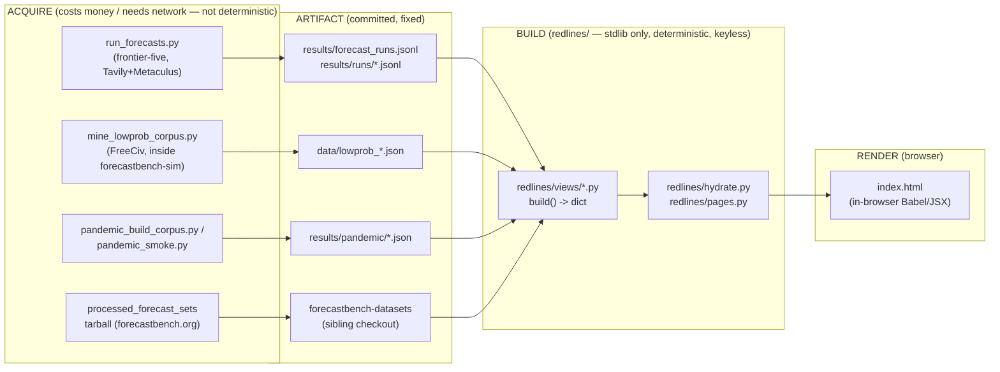

# Architecture

How this repo is put together, as of the 2026-08-13 re-architecture. This is
the document written when `redlines/` and `web/` replaced the 25
scattered `code/*.py` scripts. It describes the current shape, not the
history — see the git log for how it got here.

## The pipeline: acquire -> artifact -> build -> render

Four stages, in order. Each one only reads what the stage before it wrote.

1. **Acquire.** Scripts that talk to the outside world: paid model APIs, a
   sibling git checkout, a tarball on forecastbench.org. They cost money or
   need network access or both, and they are **not** deterministic — re-run
   `code/run_forecasts.py` and you get new forecasts, not the same ones.
   Output lands as committed files: `results/forecast_runs.jsonl`,
   `results/runs/*.jsonl`, `data/*.json`, `results/eval_full.json` (gitignored,
   regenerated locally), the `forecastbench-datasets` tarball extraction.

2. **Artifact.** The committed files acquire produced. Plain JSON/JSONL/CSV,
   checked into git (except the two gitignored regenerate-locally files noted
   above). Nothing downstream re-derives these from a model call — they are
   the fixed input to everything after.

3. **Build.** `redlines/views/*.py`, each exposing a pure `build() -> dict`
   (or `build(*paths)` where the view needs external artifact paths, e.g.
   graph4). A view reads artifacts and `redlines/config.py` constants and
   returns a plain dict — the `window.__NAME__` blob a chart reads. No
   network calls, no file writes, no randomness. `redlines/hydrate.py`
   and `redlines/pages.py` turn those dicts into HTML.

4. **Render.** The browser. Each tracked page ships a Babel `<script
   type="text/babel">` block that transpiles JSX in-browser — no npm build
   step, no bundler. `window.__NAME__` globals injected at build time are
   what the JSX reads; a name that was never injected renders as the dimmed
   mock panel (see `redlines/hydrate.py`'s docstring).



### The core invariant

**Build is free, deterministic, and keyless. API spend only happens in
acquire.** `python3 -m redlines build` and `python3 -m redlines assemble`
touch no network, need no `ANTHROPIC_API_KEY` or any other secret, and
produce the same bytes on every run, on any machine, under any
`PYTHONHASHSEED`. This is what makes the golden tests possible (next
section) and it is why a refactor of `redlines/` can be checked by running
`pytest` rather than by re-running a $150 model eval and eyeballing whether
the chart still looks right.

If a change to `redlines/` ever needs an API key or a network call to pass
its tests, that change put acquire-stage logic where build-stage logic
belongs.

## Package map

```
redlines/
  __main__.py    CLI: build / assemble / export-fb (python3 -m redlines <cmd>)
  config.py      paths (env-overridable), round pins, thresholds — see below
  registry.py    the single model table: ids, labels, ECI, colors, architecture
  stats.py       deciles / brier / bss / spearman / wilson — one impl each, constant-free
  runlog.py      results/forecast_runs.jsonl + results/runs/*.jsonl loading,
                 with the clean_forecasts read guard applied uniformly
  questions.py   schema-checked loaders for data/starter_questions.json and
                 data/severity_ladder_questions.json
  hydrate.py     splices a window.__NAME__ blob into a page between HTML
                 comment markers; used by `build`
  pages.py       manifest-driven assembly: web/<page>/ chunks -> full page
                 skeleton, or skeleton + spliced blobs; used by `assemble`
  export.py      provisional ForecastBench-2.0 ingest artifact (export-fb)
  roster.py      the 24-model ECI roster the conditional benches ran on
                 (data/causal/models.csv): ids, labels, ECI, panel membership
  views/
    graph1.py    live XPT bottom-line forecasts over time
    graph2.py    severity ladder + resolution-free coherence check
    graph3.py    calibration/resolution against ForecastBench
    graph4.py    two-simulator ECI panel
    observational.py  Graph 5: the observational conditional bench, scored in-repo
    causal.py    Graph 6: the locked StarSim causal bench (data/causal/)
    databank.py  bottom-line forecast rows (+ gated canary rows)
    timeline.py  per-date snapshots of the bottom-line forecasts
```

Every module docstring states what it was ported from (usually a
`code/make_demo_*.py` script) and what, if anything, changed in the port.
Read the module before assuming a behavior is new or old.

## The golden-test contract

`tests/test_build_golden.py` and `tests/test_assemble_golden.py` are the
thing that makes this refactor trustworthy. Each is a *self-referential*
golden test: it doesn't compare against a hand-maintained "expected output"
fixture (those drift silently), it compares fresh output against the
**tracked file already in git**.

- `test_build_golden.py`: for each of the six views, call `build()` fresh
  and diff the resulting dict against the committed `results/<name>.json`
  mirror. Six `TestCase`s, one per view.
- `test_assemble_golden.py`: for each page, call `redlines.pages.hydrate_page`
  fresh (fresh blobs + the chunks under `web/<page>/`) and diff the result
  against the committed page **byte for byte**. Two `TestCase`s, one per page.

**The contract this buys:** a refactor that changes any view's output
numbers — a rounding change, a reordered list, a dropped row — fails a test,
immediately, with no fixture to update by hand and no chart to eyeball.
`tests/test_stats.py` adds a second layer under `stats.py` specifically:
differential tests that replay each estimator against the original,
unmodified implementation extracted via `git show HEAD:code/make_demo_graph3.py`
(etc.), so the porting step itself is checked, not just the current code
against itself.

Two of the six build tests (`graph3`, `graph4`) and one of the two assemble
tests (the demo page, which embeds GRAPH3 and GRAPH4) need external sibling
checkouts (`FB_DATASETS_ROOT`, `FBSIM_ROOT`) and `results/eval_full.json`
(gitignored, regenerated locally). They `skipTest` cleanly when those are
missing, so a fresh clone's `pytest` is green without them. On this machine
all three externals are present, so all 32 tests run and pass (not skip) —
verified while writing this document.

## Determinism policy

Two things have to hold for build to be trustworthy: **byte-identical
output regardless of Python's hash-randomization seed**, and no reliance on
wall-clock time, `os.urandom`, or dict-insertion-order tricks that happen to
work today.

**Why hash seed matters here specifically.** Python randomizes `str`/`hash()`
across runs (`PYTHONHASHSEED`) by default, which randomizes the iteration
order of `set` and, in edge cases, `dict`. Any code that iterates a `set` (or
a `dict` built from one) and writes the result to JSON in that order will
silently reorder itself between runs — invisible until someone diffs two
builds and gets a spurious change, or a build run on a laptop doesn't match
the same build run in CI.

**The concrete example, still in the code today:** `redlines/views/graph2.py`,
in the coherence-check loop:

```python
for m in sorted(set(a["per_model"]) & set(b["per_model"])):
```

`set(a["per_model"]) & set(b["per_model"])` is a set intersection — its
iteration order is hash-seed-dependent. Without the `sorted()`, the
`violations` list's row order (and therefore the JSON bytes) would depend on
`PYTHONHASHSEED`, breaking the golden-test contract on any machine that
happened to hash strings differently. The `sorted()` pins it. This is the
pattern to use anywhere a `set` gets turned into an ordered output — search
`redlines/` for `sorted(` before removing one.

**Verification.** `python3 -m redlines build` and `assemble` were run under
`PYTHONHASHSEED=0`, `PYTHONHASHSEED=42`, and `PYTHONHASHSEED=1337` while
writing this document; all three produced byte-identical output, matching
each other and the tracked baseline checksums.

## The registry: one model table, five old naming conventions

Before `redlines/registry.py` existed, "which models are in the demo set"
was answered five different, disagreeing ways:

| old location | old name | scope |
|---|---|---|
| `code/eci_scores.py` | `DEMO_MODEL_SET` | the base 9-model ECI ladder |
| `code/eci_scores.py` | `GAP_FILLERS` | +2 137/143 gap-fillers |
| `code/run_forecasts.py` | `MODELS` | the frontier five |
| `code/make_demo_graph1.py` | `MODEL_COLORS` | frontier-five display colors |
| `code/pandemic_smoke.py` | `SMOKE_MODELS` | hand-typed ECI integers (!) |
| `code/make_demo_graph3.py` | `DASH_MODELS` | ForecastBench display names |

`registry.py`'s `MODELS` is the union: one row per distinct model, each
tagged with every **role** it plays (`g4_ladder`, `g4_gapfiller`, `frontier5`,
`pandemic_smoke`, `graph3_dash`). `by_role()`, `demo_set_with_eci()`,
`frontier_models()`, and `model_colors()` reproduce each old accessor's exact
shape and order, so every caller ported byte-identically. ECI is always
looked up from a dated Epoch snapshot at import time by `epoch_name` — never
hand-copied (this is what made `SMOKE_MODELS`' hand-typed integers a latent
bug: they could silently drift from the CSV). `redlines/eci.py` is the one
reader of those snapshots: the pinned 2026-07-07 vintage for every row's
`eci`, the newest file for **the panel** — `registry.panel()`, the top
`PANEL_K` = 4 runnable models by ECI, which `run_unified.py` runs by default
since 2026-08-28 — with a WARN once the newest snapshot is over 31 days old.
`model_colors()` lists the panel first and then every other model; views
filter it to the models they have rows for.

**The `architecture` field is a stub, on purpose.** Every row has one —
`"moe"` for DeepSeek-V3 (publicly documented), `"unknown"` for every other
model. The plan is for dense/MoE/distilled to be declared *in data* so the
Graph-4 "dense, non-distilled subset" view is reproducible instead of a
hand-picked exclusion list. The field exists so that work is a data edit to
`registry.py`'s `_ROWS`, not a code change — the values themselves are
still to be filled in.

`CATEGORIES` (cause-category rail: broad / AI / Biorisk / Nuclear) lives in
the same module, ported verbatim from `code/make_demo_graph1.py`. It is a
different palette for a different job than the per-model colors;
reconciling the two is an open item.

## config.py: the single source of paths and constants

Every path, round pin, threshold, and constant that used to be hand-typed
(and sometimes re-typed slightly differently) across multiple `code/*.py`
scripts now lives once in `redlines/config.py`. Each constant's docstring
names its prior home, so a value's provenance is one `grep` away.

Two things in `config.py` are flagged, not fixed, because fixing them
would change golden bytes and this port's job was to move code, not
correct data:

- **The climatology constant disagrees with itself: `0.045` vs `0.0458`.**
  `CLIM_FREECIV_COMBINED = 0.045` is Graph 4's fallback `class_base_rate`
  (from `code/make_demo_combined.py`); `CLIM_FREECIV_OBSERVED = 0.0458` is
  `code/run_eval.py`'s per-class climatology fallback — the corpus's actual
  observed yes-rate, measured independently. They were already two different
  numbers before this refactor, and both remain as they were.

  **Their reach shrank on 2026-08-14.** Both are only *fallbacks*, hit when a
  row has no corpus match. Once the corpus join was keyed on `(game_id,
  question_id)` all 1,739 eval rows match, so neither constant is reached on
  the current data: Graph 4 reads each question's own rate, and `run_eval`'s
  `score()` reads the rate `attach_base_rates` stamped. Reconciling them is
  therefore a smaller decision than it was — but still an open one, and still
  one that would move Graph 4's tracked numbers.
- **`--min-n`: resolved 2026-08-13.** The reference run used `min_n=40` — the
  artifact records it (`data/lowprob_classes.json` meta) and the selection
  confirms it (smallest selected class n=55; the two in-band classes with
  n in [30,40) were not selected). `code/mine_lowprob_corpus.py`'s default
  and docstring example said 30 and were corrected to 40.

Both are recorded so the next person who notices the mismatch finds a note
explaining it's known, rather than re-discovering it and silently "fixing"
it to whichever value they saw first.

## web/: page source, and the assembler

`index.html` (and `timeline.html`, until it was folded into `index.html`
on 2026-09-08) used to be **both** source (hand-edited JSX) and artifact
(the file `code/hydrate.py`'s `inject()` spliced data into). That dual role
is gone. Each page now has a `web/<page>/` directory: an ordered list of chunk files (`.html` for the head/shell,
`.jsx` for each React component group) plus a `manifest.json` naming the
target page, the chunk order, and the `window.__NAME__` blob names the page
needs.

`redlines/pages.py` has two entry points:

- `assemble(page_dir)` concatenates the chunks in manifest order into the
  full page text, with every blob's marker pair
  (`<!--NAME_DATA--><!--/NAME_DATA-->`) collapsed to empty — the page
  **skeleton**.
- `hydrate_page(page_dir, blobs)` assembles the skeleton, then splices each
  named blob into its marker pair using the exact block format
  `redlines.hydrate.inject()` writes — so the result is byte-identical to
  what `inject()` would produce against the real file on disk, without
  touching disk itself.

`python3 -m redlines assemble` calls `hydrate_page` for each page and writes
the result straight to the tracked file. `python3 -m redlines build` instead
calls `redlines.hydrate.inject()` per view, which reads-then-rewrites the
existing tracked file in place. **These are two different code paths that
are required to produce the same bytes** — that mutual agreement is exactly
what `tests/test_assemble_golden.py` checks, and it's what makes `web/`
genuinely the source rather than a second copy that might drift from the
first.

`web/demo/60-atoms.jsx` holds the page's shared atoms (`Panel`, `Eyebrow`,
`Stat`, `Toggle`, `LegendDot`, ...); every panel chunk, the Timeline's
included, draws on it.

## External boundaries

Three things this repo depends on but does not own or vendor:

- **`forecastbench-sim`** (sibling checkout, `FBSIM_ROOT`, default
  `~/Projects/forecastbench-sim`, pinned at commit `24d88de`). Supplies the
  FreeCiv simulation worlds, the question generator/resolver, and the model
  eval harness. `code/mine_lowprob_corpus.py`, `code/run_eval.py`,
  `code/pandemic_build_corpus.py`, and `code/pandemic_smoke.py` all run
  *inside* that repo's `uv` environment, not this one — they import
  `freeciv_world` / `fbsim_core`, which are not this repo's dependencies.
- **`forecastbench-datasets`** (sibling checkout, `FB_DATASETS_ROOT`). The
  repo itself tracks only question sets and resolution sets. The *processed
  forecast sets* Graph 3 actually reads are a tarball on forecastbench.org,
  not in git — see `docs/methodology.md` for the `curl` command and why
  re-pulling it changes Graph 3's numbers (it did, materially, on
  2026-08-11).
- **`xrisk-canaries`** (an internal FRI checkout, not published; `XRISK_CANARIES_ROOT`). **Code
  dependency removed 2026-08-28.** It used to supply the runners' whole LLM
  layer: `code/run_unified.py` and `code/run_ladder_joint.py` inserted the
  sibling checkout onto `sys.path` and imported `call_tools` / `load_keys` /
  `FORECAST_TOOLS` from `forecast.cruxgen`. Both repos are private, so nobody
  outside them could re-elicit — the dashboard rebuilt fine from committed
  inputs, but the *acquisition* half of the pipeline was unreproducible. Those
  ~400 lines now live here as `redlines/llm.py` (the agentic loop, carried over
  verbatim) and `redlines/tools.py` (Tavily + Metaculus, verbatim -- until
  2026-09-02, when the Metaculus lookup left and a Tavily page reader joined;
  see the module docstring and `docs/methodology.md`, "Grounding"). `load_keys()`
  was rewritten rather than copied: upstream reached for GCP Secret Manager
  through a hardcoded macOS path that has never existed on the cron box, so it
  now reads the env file that box already sources.

  What remains is a **data** read: the near-term canary questions
  `redlines/views/databank.py` joins to the bottom-line forecasts
  (`xrisk_canary_corpus.jsonl`, `forecast_runs.jsonl`). It is inert today —
  canaries are gated off by default (`build(include_canaries=False)`) per the
  2026-08-10 call's v2 deferral — which is why `python3 -m redlines build`
  succeeds with `XRISK_CANARIES_ROOT` pointed at a nonexistent path. **If v2
  turns canaries back on, that corpus has to be vendored too**, on the same
  reasoning as above.

`FBSIM_ROOT` and `FB_DATASETS_ROOT` are still **plain file reads** — neither is
vendored, versioned as a dependency, or wrapped behind an interface; they are
filesystem paths in `redlines/config.py`, overridable by environment variable for
boxes where the checkout doesn't live at the default location (e.g. the cron
host, see below). Both feed the simulation/benchmark panels, which ship as
committed JSON blobs, so they gate re-deriving those panels rather than building
the site. Vendoring their inputs — the starsim/FreeCiv data and the ForecastBench
tarball — is the remaining gap in "reproduce it from this repo alone."

## Deploy notes

The one thing that runs on a schedule, outside this machine: `code/cron_run.sh`
on a Linux box (the host behind `airo.forecastingresearch.org`), cron-fired weekly (Fridays
12:00 UTC). It sources `~/.config/redlines/env` for API keys, then runs:

```bash
"$PY" code/run_unified.py --joint --repeats 1 --workers 2 \
    --conditions data/combined_conditions.json --out results/runs/<timestamp>.jsonl
```

`$PY` only has to be an interpreter with the acquisition extra installed
(`pip install -e '.[acquire]'`, which is just litellm); `REDLINES_PY` overrides
it (historically it pointed at the venv of the internal checkout the LLM layer
was imported from before it was vendored). `--joint` is the single instrument:
one call per model answers every question×horizon cell unconditionally *and*
under each condition of the combined set (the LEAP policies plus the model's own
capability percentiles), once per model since 2026-09-02. The unconditional
slice lands in the dated output file; the whole instrument is appended to
`results/conditional_runs_combined.jsonl`. The runner's preflight refuses a
live-ECI snapshot (`data/live_metr_eci_frontier.json`) older than ten days, since
the capability conditions quote the frontier ECI; the box cannot refresh it
itself (the refresh needs Node + Playwright), so it is refreshed elsewhere and
synced with `data/`. Each run writes its own dated file under
`results/runs/`, rather than appending to the shared
`results/forecast_runs.jsonl` — two independent writers on one tracked file
would conflict every week — and `runlog.py`'s `load_runlog()` reads the
historical log plus that whole directory, so nothing needs merging by hand.
Run files are pulled down from the box with rsync into `results/runs/` and
committed here.

**Both outstanding deploy items were closed on 2026-08-13:**

1. **The box's checkout is current.** Note it is an *rsynced copy, not a git
   clone* — deploy code changes with rsync from the laptop repo root,
   excluding `results/`, `.git/`, `__pycache__/`, `.env` and `archive/`
   (excluding `results/` keeps the box's accrued run files safe).
2. **`~/.config/redlines/env` is installed** (mode 600). Verified end-to-end
   the same day: `--probe` green for all five models, plus one grounded
   `--smoke` forecast (7 evidence items, so the Tavily and Metaculus keys
   worked too).

### Serving

The dashboard is served from the box itself: a reverse proxy forwards
`https://airo.forecastingresearch.org` to a local nginx docroot. `index.html` is the site;
`timeline.html`, folded into it on 2026-09-08, is published as a redirect stub
to `/` so old links still land.

`code/publish_dashboard.sh` (box-side) first runs the launch validator
(`code/validate_launch_run.py`: every panel model, every question, one call
per cell, on one date across all three instruments — otherwise publication is
withheld and the last good site stays up), then rebuilds the run-log-driven
blobs and the download (`python3 -m redlines build --views
g1,g2,databank,timeline,conditional,capability,axes,method,csv` — Graph 3,
Graph 4 and the two bench panels are frozen artifacts and pass through
untouched) and copies the page and the download files into the docroot
atomically. `cron_run.sh` calls it after every
successful weekly run, so the served dashboard updates itself as the time
series accrues; a publish failure is logged but never masks the run itself.

## Open items

Things that are known, decided-not-now, or waiting on a person — recorded
here so they don't have to be rediscovered.

- **Blob provenance stamps, deferred.** Adding a "built at / from commit X"
  stamp to each `window.__NAME__` blob was considered and set aside: it
  would change every blob's bytes, which fails every golden test the moment
  it lands, and the paper draft's **~Sep 1** deadline meant no golden-byte
  churn until after that date. Revisit after Sep 1.
- **JS-helper duplication between `web/demo` and `web/timeline`** —
  resolved 2026-09-08 by folding the timeline page into `index.html`
  (`web/demo/19-live-timeline.jsx`); there is one atoms chunk now.
- **Repo home: `elsehow/` vs. the `forecastingresearch` org.** This repo
  currently lives under a personal namespace. The plan puts FRI
  advisor review before public release; moving the repo to the
  `forecastingresearch` org (matching `forecastbench-sim`'s home) is a
  decision for that point in the timeline, not before.
- **No Graph-3 comparability *report generator*.** The numbers in
  `docs/methodology.md`'s tables (the 0.002 / 0.035 / 0.013 decomposition,
  the horizon-maturity table, the version-bump table) are hand-transcribed
  from `results/graph3_comparability.json`, which
  `code/graph3_comparability.py` does write. There is no script that turns
  that JSON into the markdown tables — every re-run of
  `graph3_comparability.py` (which the methodology doc itself warns will
  produce different numbers as ForecastBench data matures) requires someone
  to re-copy numbers into prose by hand, with the transcription-error risk
  that implies. Worth a small generator; not built.
